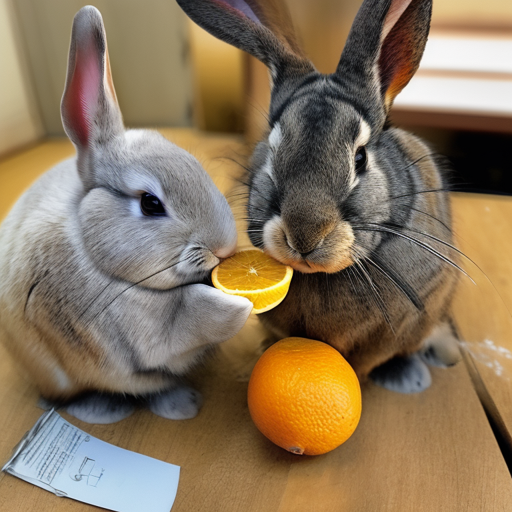
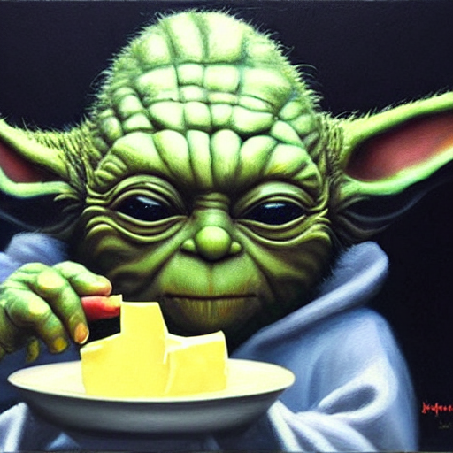
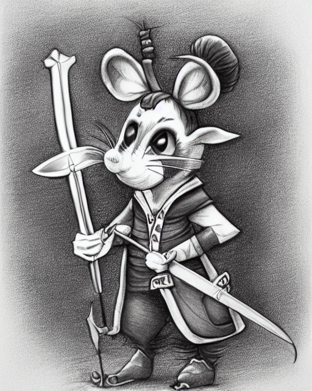
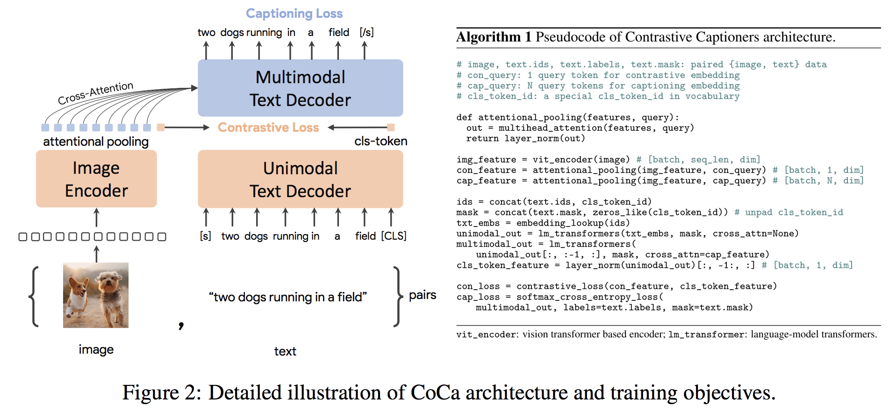

# Prompt Text Prediction from a Generated Image

This repository contains Python code to fine-tune models that can predict prompts and/or embeddings from generated images. The commonly know process is generating images from a given text is popular process for the currenlty trending job title [prompt engineer](https://en.wikipedia.org/wiki/Prompt_engineering); however, this repo. is focused on the reverse process which is predicting the text prompt given to generate an image. Given a set of data as prompt-image pairs the following models are fine-tuned to either predict the text or text embeddings:
- [CoCa (Contrastive Captioners are Image-Text Foundation Models)](https://github.com/lucidrains/CoCa-pytorch): fine-tune on a dataset to predict the prompt text for a given image
- [OpenAI CLIP-ViT](https://huggingface.co/openai/clip-vit-large-patch14): fine-tune on a dataset to predict the prompt text embeddings for a given image

# Example Data: SD2 Prompt-Image Pairs
Below are a few example prompt-image pairs for SD2. The objective of this work is to predict the prompt text used to generate the images. Given a dataset, like the below, the code within this repo. can be used to fine-tune various models to predict the text prompt when given the generated image.
- Left Prompt: `fat rabbits with oranges, photograph iphone, trending`
- Middle Prompt: `a hyper realistic oil painting of Yoda eating cheese, 4K`
- Right Prompt: `a pencil drawing portrait of an anthropomorphic mouse adventurer holding a sword. by pen tacular`
<p float="left">
  
  
    
</p>

The work in this repository was part of the [Kaggle Stable Diffusion - Image to Prompts](https://www.kaggle.com/competitions/stable-diffusion-image-to-prompts) competition. This was code I created during the competition and was able to earn a [Top 5%](https://www.kaggle.com/dunlap0924) finish in the competition.

# Accelerating Image Generation
Training these models and generating images with Stable Diffusion 2 is resource intensive and mandates a GPU. Measures can be taken to help accelerate image generation such as:
- [xformers](https://github.com/facebookresearch/xformers) library to accelerate transforms,
- reducing default image size from 768 x 768 to a lower resolution,
- decreasing the default step size from 50.

Using these steps, with a RTX 3090, image were generated at approximately 2s/image. 

# Download or Generate Image-Prompt Pairs
## Download URL Datasets
Prompt-image pair datasets were downloaded via URL using the [img2dataset](https://github.com/rom1504/img2dataset) package. A few examples of online URL datasets are: 
* [mscoco](dataset_examples/mscoco.md) 600k image/text pairs that can be downloaded in 10min
* [sbucaptions](dataset_examples/SBUcaptions.md) 860K image/text pairs can be downloaded in 20 mins.
* [cc3m](dataset_examples/cc3m.md) 3M image/text pairs that can be downloaded in one hour
* [laion400m](dataset_examples/laion400m.md) 400M image/text pairs that can be downloaded in 3.5 days
* [laion5B](dataset_examples/laion5B.md) 5B image/text pairs that can be downloaded in 7 days using 10 nodes

## Generating Stable Diffusion 2 Images
Custom prompt-image pair datasets were created using Stable Diffusion Version 2. I recommend users interested in creating their own datasets with Stable Diffusion 2 follow the commonly updated instructions at [Stable Diffusion Version 2](https://github.com/Stability-AI/stablediffusion).

# Formatting Data for Model Training

Prompt-image pairs needed to be formatted accordingly for the model they will be fine-tuning. Refer to `./notebooks/data-format-train-val.ipynb` which shows how to format various datasets.

# Removing Similar Prompts with Similarity Search
Many of the online prompt-image pair datasets contain prompts that are highly similar and this can cause model to learn commonly occuring prompts and not perform as well on diverse text prompts. Therefore, similar prompts they were removed using a GPU enabled [cosine similarity](https://en.wikipedia.org/wiki/Cosine_similarity) indexing or similarity search. Refer to [`./utils/filt_embeds.py`](./utils/filt_embeds.py) which contains the code to rapidly index and filter text embeddings. 

This process was conductd on a GPU which leveraged the [Faiss library](https://github.com/facebookresearch/faiss). Faiss is a library for efficient similarity search and clustering of dense vectors. It contains algorithms that search in sets of vectors of any size, up to ones that possibly do not fit in RAM. 

```python
# Create an IndexFlatIP index using the Faiss library
# The term 'IP' represents the Inner Product, 
# which is equivalent to cosine similarity as it involves taking the dot product of normalized vectors.
resources = faiss.StandardGpuResources()
index = faiss.IndexIVFFlat(faiss.IndexFlatIP(384), 384, 5, faiss.METRIC_INNER_PRODUCT)
gpu_index = faiss.index_cpu_to_gpu(resources, 0, index)

# Normalize the input vector and add it to the IndexFlatIP 
gpu_index.train(F.normalize(vector).cpu().numpy())
gpu_index.add(F.normalize(vector).cpu().numpy())
```
# Models
## CoCa: Contrastive Captioners are Image-Text Foundation Models
The [CoCa](https://arxiv.org/abs/2205.01917) architecture is a novel encoder-decoder approach that simultaneously produces aligned unimodal image and text embeddings and joint multimodal representations, making it flexible enough to be directly applicable for all types of downstream tasks. Specifically, CoCa achieves state-of-the-art results on a series of vision and vision-language tasks spanning vision recognition, cross-modal alignment, and multimodal understanding. Furthermore, it learns highly generic representations so that it can perform as well or better than fully fine-tuned models with zero-shot learning or frozen encoders. Fine-tuning was conducted following the recommendations of from [here](https://github.com/mlfoundations/open_clip#fine-tuning-coca). The CoCa architecture is shown below and was taken from [source](https://arxiv.org/abs/2205.01917).


Python code to fine-tune CoCa is in `./scripts/train_COCA.py` and a bash command is given below:
```bash
python3 -m training.main \
    --dataset-type "csv" \
    --train-data "./kaggle/diffusiondb_ds2_ds3-2000_Train_TRUNNone_filts_COCA.csv" \
    --warmup 10000 \
    --batch-size 16 \
    --lr 1e-05 \
    --wd 0.1 \
    --epochs 1 \
    --workers 8 \
    --model coca_ViT-L-14 \
    --pretrained "./kaggle/input/open-clip-models/mscoco_finetuned_CoCa-ViT-L-14-laion2B-s13B-b90k.bin" \
    --report-to "wandb" \
    --wandb-project-name "StableDiffusion" \
    --coca-contrastive-loss-weight 0 \
    --coca-caption-loss-weight 1 \
    --log-every-n-steps 1000 \
    --seed 42 \
```
## CLIP (Contrastive Language-Image Pre-Training) 
The CLIP (Contrastive Language-Image Pre-Training) is a neural network trained on a variety of (image, text) pairs. It can be instructed in natural language to predict the most relevant text snippet, given an image, without directly optimizing for the task, similarly to the zero-shot capabilities of GPT-2 and 3. The CLIP architecture is shown in the below image and was taken from [source](https://github.com/openai/CLIP).


The [Vision Transformer (ViT)](https://arxiv.org/abs/2010.11929) image encoder from CLIP was fined-tuned in this repository. The following Python scripts demonstrate how to tune ViT:
- [ViT with TIMM Model](./src/train_ViT.py)
- [Open-Clip ViT with Hugging Face](./src/train-HF.py)

```python
class Net(nn.Module):
    def __init__(self, model_name):
        super(Net, self).__init__()
        clip = AutoModel.from_pretrained(model_name)
        self.vision = clip.vision_model
        self.fc = nn.Linear(1024, 384)
        self.dropout = nn.Dropout(0.25)

    def forward(self, x):
        out = self.vision(x)['pooler_output']
        return self.fc(out)
```

# References

- [CoCa (Contrastive Captioners are Image-Text Foundation Models)](https://github.com/lucidrains/CoCa-pytorch)
- [Faiss library](https://github.com/facebookresearch/faiss)
- [img2dataset](https://github.com/rom1504/img2dataset)
- [Kaggle Competition: Stable Diffusion - Image to Prompts](https://www.kaggle.com/competitions/stable-diffusion-image-to-prompts)
- [OpenAI CLIP-ViT](https://huggingface.co/openai/clip-vit-large-patch14)
- [PyTorch Image Models (TIMM)](https://timm.fast.ai/) 
- [Stable Diffusion Version 2 GitHub](https://github.com/Stability-AI/stablediffusion)
- [Vision Transformer (ViT)](https://arxiv.org/abs/2010.11929)
- [Weights & Biases](https://wandb.ai/site)
- [xformers](https://github.com/facebookresearch/xformers) 
